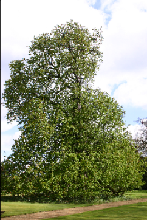
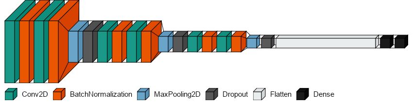

## 🧠 Intelligent Systems and Pattern Recognition (University of Pisa, 13/07/2021)

This folder contains my midterm projects for the *Intelligent Systems and Pattern Recognition* (ISPR) course at the University of Pisa.  
Each assignment tackled a practical problem in computer vision, machine learning, or deep learning, combining theoretical study with hands-on implementation.

---

### 📄 Midterm 1: Image Segmentation with Normalized Cut (N-Cut)

- **Goal:** Segment natural images (tree dataset) using normalized cuts on region adjacency graphs.
- **Approach:**  
  ✅ Initial superpixel segmentation (SLIC, K-means)  
  ✅ Region adjacency graph construction (RAG)  
  ✅ Normalized Cut optimization (Scikit-Image)  
  ✅ Grid-search and custom metrics to improve over visual parameter tuning

- **Key results:**  
  - Achieved ~60% average accuracy on dense tree subsets after parameter tuning.

| Original Image        | K-means Segmentation      | Normalized Cut Segmentation  |
|-----------------------|--------------------------|-------------------------------|
|  |  |   |

---

### 📄 Midterm 2: Image Understanding with LDA and Bag of Visual Words

- **Goal:** Apply Latent Dirichlet Allocation (LDA) to Bag of Visual Words representations for unsupervised image understanding.
- **Approach:**  
  ✅ SIFT descriptors on MSER keypoints  
  ✅ Grid-based DAISY descriptors  
  ✅ LDA topic modeling to extract latent categories

- **Key insights:**  
  - Sparse sampling focused on informative regions, grid sampling covered global context.  
  - Proposed adaptive sampling to combine benefits.

---

### 📄 Midterm 3: Adversarial Attacks and Training on CIFAR-10 CNNs

- **Goal:** Evaluate and improve CNN robustness under adversarial attacks.
- **Approach:**  
  ✅ Trained CNN with Keras, reaching 86% accuracy  
  ✅ Attacks: FGSM, PGD, Carlini-Wagner (CleverHans)  
  ✅ Adversarial training with fixed/random ε

- **Key insights:**  
  - Showed selective resistance to attacks; discussed robustness–accuracy tradeoffs and transferability.

**CNN Architecture**                                      
 

**Adversarial Example**                                               

---

### 📄 Midterm 4: Unpaired Image-to-Image Translation with CycleGAN

- **Goal:** Review CycleGAN for unpaired image-to-image translation.
- **Content:**  
  ✅ Adversarial + cycle-consistency losses  
  ✅ Generator: ResNet blocks; Discriminator: PatchGAN  
  ✅ Applications: object transfiguration, season/style transfer

- **Key results:**  
  - Compared performance on Cityscapes with BiGAN, CoGAN, SimGAN, pix2pix  
  - Discussed limitations and extensions toward multimodal translation

---

### 🏆 Outcome

Final grade: **28/30**

---

### 💡 Key learning points

- Applied graph-based segmentation, unsupervised learning, adversarial robustness, and generative models  
- Explored hands-on computer vision and deep learning pipelines  
- Practiced critical reading and synthesis of cutting-edge papers

markdown
Copia codice
### 📂 Structure
/ISPR \
├── midterm1_ncut_segmentation/ \
│ ├── ISPR - Midterm 1 - Petix.pdf \
│ ├── midterm1_petix.ipynb \
│ ├── README.md \
│ └── resources/ \
│     ├── image.png \
│     ├── kmeans.png \
│     └── ncut.png \
├── midterm2_lda_image_understanding/ \
│ ├── ISPR - Midterm 2 - Petix.pdf \
│ ├── midterm2_petix.ipynb \
│ └── README.md \
├── midterm3_adversarial_attacks/ \
│ ├── ISPR - Midterm 3 - Petix.pdf \
│ ├── midterm3_petix.ipynb \
│ ├── README.md \
│ └── resources/ \
│     ├── frog_1.gif \
│     ├── frog_2.gif \
│     ├── frog_inf.gif \
│     └── output.png \
├── midterm4_cyclegan_paper_review/ \
│ ├── Petix - Midterm 4.pdf \
│ └── README.md \
└── README.md
