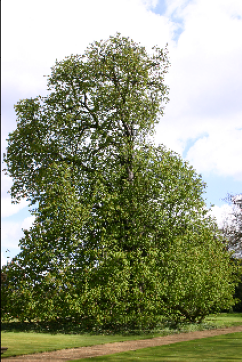
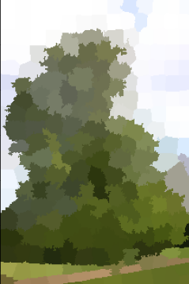
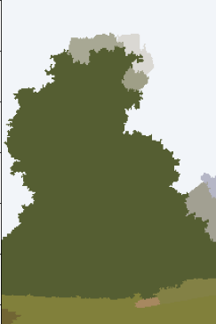

# 📄 Midterm 1: Image Segmentation with Normalized Cut (N-Cut)

- **Goal:** Segment natural images (tree dataset) using normalized cuts on region adjacency graphs.
- **Approach:**  
  ✅ Initial superpixel segmentation (SLIC, K-means)  
  ✅ Region adjacency graph construction (RAG)  
  ✅ Normalized Cut optimization (Scikit-Image)  
  ✅ Grid-search and custom metrics to improve over visual parameter tuning

- **Key results:**  
  - Achieved ~60% average accuracy on dense tree subsets after parameter tuning.

| Original Image        | K-means Segmentation      | Normalized Cut Segmentation  |
|-----------------------|--------------------------|-------------------------------|
|  |  |   |
