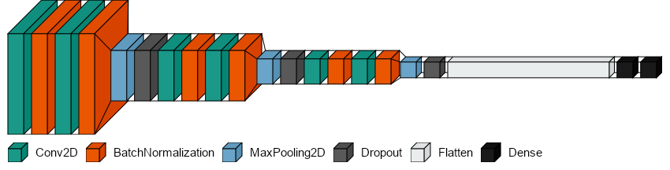
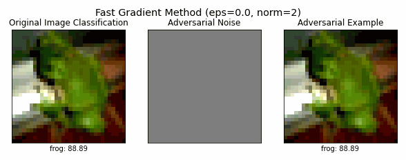

# 📄 Midterm 3: Adversarial Attacks and Training on CIFAR-10 CNNs

- **Goal:** Evaluate and improve CNN robustness under adversarial attacks.
- **Approach:**  
  ✅ Trained CNN with Keras, reaching 86% accuracy  
  ✅ Attacks: FGSM, PGD, Carlini-Wagner (CleverHans)  
  ✅ Adversarial training with fixed/random ε

- **Key insights:**  
  - Showed selective resistance to attacks; discussed robustness–accuracy tradeoffs and transferability.

**CNN Architecture**                                      
 

**Adversarial Example**                                               
